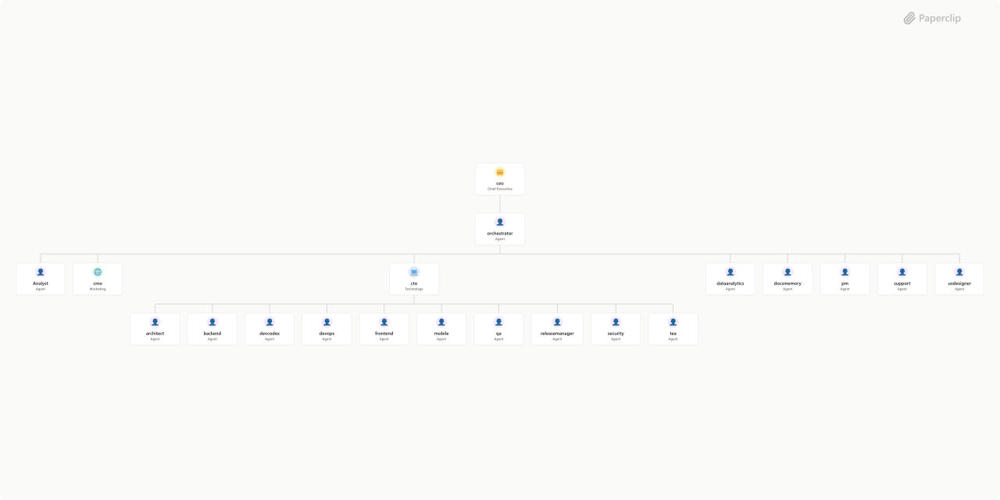

# BIRCK

> A Paperclip company package for running a reusable software factory with BMAD-inspired workflows.



## What's Inside

> This is an [Agent Company](https://agentcompanies.io) package from [Paperclip](https://paperclip.ing)

| Content | Count |
|---------|-------|
| Agents | 20 |
| Skills | 104 |

### Agents

| Agent | Role | Reports To |
|-------|------|------------|
| Analyst | Agent | orchestrator |
| architect | Agent | cto |
| backend | Agent | cto |
| ceo | Agent | — |
| cmo | Agent | orchestrator |
| cto | Agent | orchestrator |
| dataanalytics | Agent | orchestrator |
| devcodex | Agent | cto |
| devops | Agent | cto |
| docsmemory | Agent | orchestrator |
| frontend | Agent | cto |
| mobile | Agent | cto |
| orchestrator | Agent | ceo |
| pm | Agent | orchestrator |
| qa | Agent | cto |
| releasemanager | Agent | cto |
| security | Agent | cto |
| support | Agent | orchestrator |
| tea | Agent | cto |
| uxdesigner | Agent | orchestrator |

### Skills

| Skill | Description | Source |
|-------|-------------|--------|
| bmad-advanced-elicitation | 'Push the LLM to reconsider, refine, and improve its recent output. Use when user asks for deeper critique or mentions a known deeper critique method, e.g. socratic, first principles, pre-mortem, red team.' | catalog |
| bmad-agent-analyst | Strategic business analyst and requirements expert. Use when the user asks to talk to Mary or requests the business analyst. | catalog |
| bmad-agent-architect | System architect and technical design leader. Use when the user asks to talk to Winston or requests the architect. | catalog |
| bmad-agent-dev | Senior software engineer for story execution and code implementation. Use when the user asks to talk to Amelia or requests the developer agent. | catalog |
| bmad-agent-pm | Product manager for PRD creation and requirements discovery. Use when the user asks to talk to John or requests the product manager. | catalog |
| bmad-agent-tech-writer | Technical documentation specialist and knowledge curator. Use when the user asks to talk to Paige or requests the tech writer. | catalog |
| bmad-agent-ux-designer | UX designer and UI specialist. Use when the user asks to talk to Sally or requests the UX designer. | catalog |
| bmad-brainstorming | 'Facilitate interactive brainstorming sessions using diverse creative techniques and ideation methods. Use when the user says help me brainstorm or help me ideate.' | catalog |
| bmad-check-implementation-readiness | 'Validate PRD, UX, Architecture and Epics specs are complete. Use when the user says "check implementation readiness".' | catalog |
| bmad-checkpoint-preview | 'LLM-assisted human-in-the-loop review. Make sense of a change, focus attention where it matters, test. Use when the user says "checkpoint", "human review", or "walk me through this change".' | catalog |
| bmad-code-review | 'Review code changes adversarially using parallel review layers (Blind Hunter, Edge Case Hunter, Acceptance Auditor) with structured triage into actionable categories. Use when the user says "run code review" or "review this code"' | catalog |
| bmad-correct-course | 'Manage significant changes during sprint execution. Use when the user says "correct course" or "propose sprint change"' | catalog |
| bmad-create-architecture | 'Create architecture solution design decisions for AI agent consistency. Use when the user says "lets create architecture" or "create technical architecture" or "create a solution design"' | catalog |
| bmad-create-epics-and-stories | 'Break requirements into epics and user stories. Use when the user says "create the epics and stories list"' | catalog |
| bmad-create-prd | 'DEPRECATED — consolidated into bmad-prd create intent - this skill will be removed in v7 in favor of `bmad-prd`.' | catalog |
| bmad-create-story | 'Creates a dedicated story file with all the context the agent will need to implement it later. Use when the user says "create the next story" or "create story [story identifier]"' | catalog |
| bmad-customize | Authors and updates customization overrides for installed BMad skills. Use when the user says 'customize bmad', 'override a skill', 'change agent behavior', or 'customize a workflow'. | catalog |
| bmad-dev-story | 'Execute story implementation following a context filled story spec file. Use when the user says "dev this story [story file]" or "implement the next story in the sprint plan"' | catalog |
| bmad-document-project | 'Document brownfield projects for AI context. Use when the user says "document this project" or "generate project docs"' | catalog |
| bmad-domain-research | 'Conduct domain and industry research. Use when the user says wants to do domain research for a topic or industry' | catalog |
| bmad-edit-prd | 'DEPRECATED — consolidated into bmad-prd update intent - this skill will be removed in v7 in favor of `bmad-prd`.' | catalog |
| bmad-editorial-review-prose | 'Clinical copy-editor that reviews text for communication issues. Use when user says review for prose or improve the prose' | catalog |
| bmad-editorial-review-structure | 'Structural editor that proposes cuts, reorganization, and simplification while preserving comprehension. Use when user requests structural review or editorial review of structure' | catalog |
| bmad-generate-project-context | 'Create project-context.md with AI rules. Use when the user says "generate project context" or "create project context"' | catalog |
| bmad-help | 'Analyzes current state and user query to answer BMad questions or recommend the next skill(s) to use. Use when user asks for help, bmad help, what to do next, or what to start with in BMad.' | catalog |
| bmad-index-docs | 'Generates or updates an index.md to reference all docs in the folder. Use if user requests to create or update an index of all files in a specific folder' | catalog |
| bmad-investigate | Forensic case investigation with evidence-graded findings, calibrated to the input. Use when the user asks to investigate a bug, trace what caused an incident, walk through unfamiliar code, or build a mental model of a code area before working on it. | catalog |
| bmad-market-research | 'Conduct market research on competition and customers. Use when the user says they need market research' | catalog |
| bmad-party-mode | 'Orchestrates group discussions between installed BMAD agents, enabling natural multi-agent conversations where each agent is a real subagent with independent thinking. Use when user requests party mode, wants multiple agent perspectives, group discussion, roundtable, or multi-agent conversation about their project.' | catalog |
| bmad-prd | Create, update, or validate a PRD. Use when the user wants help producing, editing, or validating a PRD. | catalog |
| bmad-prfaq | Working Backwards PRFAQ challenge to forge product concepts. Use when the user requests to 'create a PRFAQ', 'work backwards', or 'run the PRFAQ challenge'. | catalog |
| bmad-product-brief | Create, update, or validate a product brief. Use when the user wants help producing, editing, or validating a brief. | catalog |
| bmad-qa-generate-e2e-tests | 'Generate end to end automated tests for existing features. Use when the user says "create qa automated tests for [feature]"' | catalog |
| bmad-quick-dev | 'Implements any user intent, requirement, story, bug fix or change request by producing clean working code artifacts that follow the project''s existing architecture, patterns and conventions. Use when the user wants to build, fix, tweak, refactor, add or modify any code, component or feature.' | catalog |
| bmad-retrospective | 'Post-epic review to extract lessons and assess success. Use when the user says "run a retrospective" or "lets retro the epic [epic]"' | catalog |
| bmad-review-adversarial-general | 'Perform a Cynical Review and produce a findings report. Use when the user requests a critical review of something' | catalog |
| bmad-review-edge-case-hunter | 'Walk every branching path and boundary condition in content, report only unhandled edge cases. Orthogonal to adversarial review - method-driven not attitude-driven. Use when you need exhaustive edge-case analysis of code, specs, or diffs.' | catalog |
| bmad-shard-doc | 'Splits large markdown documents into smaller, organized files based on level 2 (default) sections. Use if the user says perform shard document' | catalog |
| bmad-spec | Distill any intent input into the SPEC kernel + companions — the canonical, preservation-validated machine contract for downstream work. Use when the user says "create a spec", "distill this into a spec", "validate this spec", or "update the spec". | catalog |
| bmad-sprint-planning | 'Generate sprint status tracking from epics. Use when the user says "run sprint planning" or "generate sprint plan"' | catalog |
| bmad-sprint-status | 'Summarize sprint status and surface risks. Use when the user says "check sprint status" or "show sprint status"' | catalog |
| bmad-technical-research | 'Conduct technical research on technologies and architecture. Use when the user says they would like to do or produce a technical research report' | catalog |
| bmad-ux | Plan UX patterns and design specifications. Use when the user says "lets create UX design" or "create UX specifications" or "help me plan the UX" | catalog |
| bmad-validate-prd | 'DEPRECATED — consolidated into bmad-prd validate intent - this skill will be removed in v7 in favor of `bmad-prd`.' | catalog |
| caveman | > | catalog |
| bmad-advanced-elicitation | — | catalog |
| bmad-agent-analyst | — | catalog |
| bmad-agent-architect | — | catalog |
| bmad-agent-dev | — | catalog |
| bmad-agent-pm | — | catalog |
| bmad-agent-tech-writer | — | catalog |
| bmad-agent-ux-designer | — | catalog |
| bmad-brainstorming | — | catalog |
| bmad-check-implementation-readiness | — | catalog |
| bmad-checkpoint-preview | — | catalog |
| bmad-code-review | — | catalog |
| bmad-correct-course | — | catalog |
| bmad-create-architecture | — | catalog |
| bmad-create-epics-and-stories | — | catalog |
| bmad-create-prd | — | catalog |
| bmad-create-story | — | catalog |
| bmad-customize | — | catalog |
| bmad-dev-story | — | catalog |
| bmad-document-project | — | catalog |
| bmad-domain-research | — | catalog |
| bmad-edit-prd | — | catalog |
| bmad-editorial-review-prose | — | catalog |
| bmad-editorial-review-structure | — | catalog |
| bmad-generate-project-context | — | catalog |
| bmad-help | — | catalog |
| bmad-index-docs | — | catalog |
| bmad-investigate | — | catalog |
| bmad-market-research | — | catalog |
| bmad-party-mode | — | catalog |
| bmad-prd | — | catalog |
| bmad-prfaq | — | catalog |
| bmad-product-brief | — | catalog |
| bmad-qa-generate-e2e-tests | — | catalog |
| bmad-quick-dev | — | catalog |
| bmad-retrospective | — | catalog |
| bmad-review-adversarial-general | — | catalog |
| bmad-review-edge-case-hunter | — | catalog |
| bmad-shard-doc | — | catalog |
| bmad-spec | — | catalog |
| bmad-sprint-planning | — | catalog |
| bmad-sprint-status | — | catalog |
| bmad-technical-research | — | catalog |
| bmad-ux | — | catalog |
| bmad-validate-prd | — | catalog |
| caveman | — | catalog |
| diagnose-why-work-stopped | — | catalog |
| paperclip-converting-plans-to-tasks | — | catalog |
| paperclip-create-agent | — | catalog |
| paperclip-create-plugin | — | catalog |
| paperclip-dev | — | catalog |
| paperclip | — | catalog |
| para-memory-files | — | catalog |
| terminal-bench-loop | — | catalog |
| paperclip-board | Manage a Paperclip company as a board member via chat. Covers onboarding (company creation, CEO setup, hiring plans), agent management, approvals, task monitoring, cost oversight, and work product review. Use this skill whenever the user wants to interact with their Paperclip control plane. | [github](https://github.com/paperclipai/paperclip/tree/master/skills/paperclip-board) |
| paperclip-converting-plans-to-tasks | The Paperclip way of converting a plan into executable tasks. Use whenever you are asked to plan, scope, or break down work inside a Paperclip company. Industry-agnostic guidance on how to translate a plan into assigned issues with the right specialty, dependencies, and parallelization so Paperclip's executor can pick up the work — it does not prescribe a plan format. Pair with the `paperclip` skill, which covers the mechanics of writing the plan document and reassigning the issue. | [github](https://github.com/paperclipai/paperclip/tree/master/skills/paperclip-converting-plans-to-tasks) |
| paperclip-create-agent | Create new agents in Paperclip with governance-aware hiring. Use when you need to inspect adapter configuration options, compare existing agent configs, draft a new agent prompt/config, and submit a hire request. | [github](https://github.com/paperclipai/paperclip/tree/master/skills/paperclip-create-agent) |
| paperclip-dev | Develop and operate a local Paperclip instance — start and stop servers, pull updates from master, run builds and tests, manage worktrees, back up databases, and diagnose problems. Use whenever you need to work on the Paperclip codebase itself or keep a running instance healthy. | [github](https://github.com/paperclipai/paperclip/tree/master/skills/paperclip-dev) |
| paperclip | Interact with the Paperclip control plane API to manage tasks, coordinate with other agents, and follow company governance. Use when you need to check assignments, update task status, delegate work, post comments, set up or manage routines (recurring scheduled tasks), or call any Paperclip API endpoint. Do NOT use for the actual domain work itself (writing code, research, etc.) — only for Paperclip coordination. | [github](https://github.com/paperclipai/paperclip/tree/master/skills/paperclip) |
| para-memory-files | File-based memory system using Tiago Forte's PARA method. Use this skill whenever you need to store, retrieve, update, or organize knowledge across sessions. Covers three memory layers: (1) Knowledge graph in PARA folders with atomic YAML facts, (2) Daily notes as raw timeline, (3) Tacit knowledge about user patterns. Also handles planning files, memory decay, weekly synthesis, and recall via qmd. Trigger on any memory operation: saving facts, writing daily notes, creating entities, running weekly synthesis, recalling past context, or managing plans. | [github](https://github.com/paperclipai/paperclip/tree/master/skills/para-memory-files) |

## Getting Started

```bash
pnpm paperclipai company import this-github-url-or-folder
```

See [Paperclip](https://paperclip.ing) for more information.

---
Exported from [Paperclip](https://paperclip.ing) on 2026-06-20
